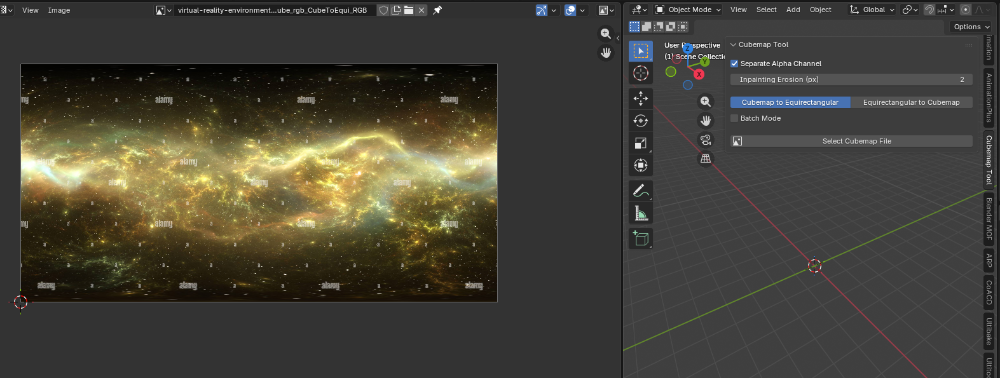
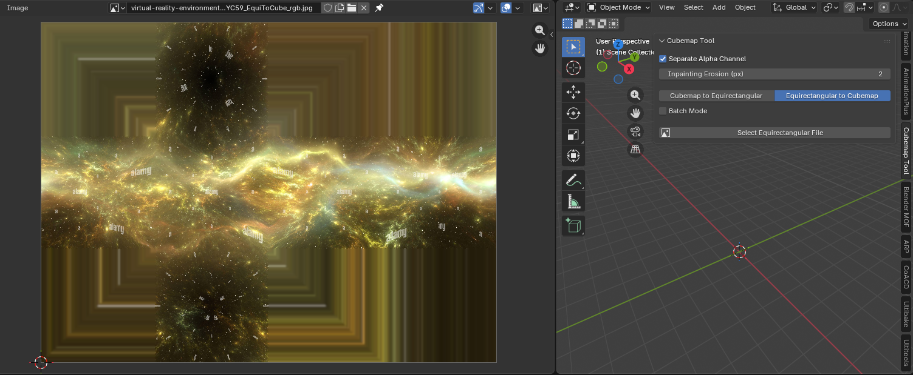
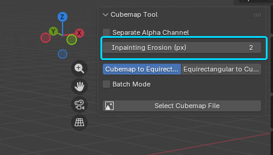

# BlenderCubemapConverter
Blender Addon for Converting between Cubemap and Equirectangular textures using py360converter library and Scikit-image library.

## Requirements & Compatibility
- **Blender Version:** 4.2 or higher
- **Supported OS:** Windows, Linux, MacOS (Apple Silicon supported)

## Features
- **Two-Way Conversion:** Convert **Equirectangular to Cubemap** and **Cubemap to Equirectangular**.
- **Format Support:** Supports most image formats including **HDR** and **EXR** (Linear color space) as well as PNG, JPG, etc.
- **Batch Processing:** Convert single files or entire directories.
- **Background Processing:** Operations run in the background to prevent freezing Blender.
- **Separate Alpha:** Option to save Alpha as a separate image file.

## Examples
### Cubemap to Equirectangular

### Equirectangular to Cubemap

## Inpainting Erosion
This parameter fixes edge artifacts (seams) that can occur during conversion by extending the valid pixels into the empty space. 
- **Default:** 2 pixels
- **Disable:** Set to 0 to disable inpainting.

## Installation
Simply download the latest release from the releases page and add it to your Blender addons folder.

## Credits
Huge credit to Py360Convert GitHub page for the libraries needed for this to work with python:
https://github.com/sunset1995/py360convert

